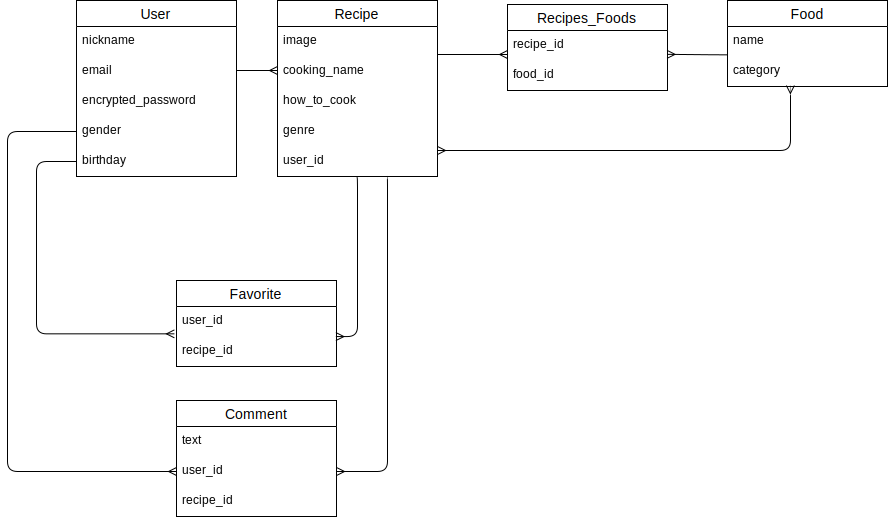

Minima-Recipe
=============

必要最低限(minimalism)の材料で作れるレシピの投稿サイトです。 

ユーザーは最も重要な食材を2つ選択し、レシピを投稿します。 

検索フォームから今家にある食材を選択し検索を行うことで、レシピが簡単に検索できます。 

# URL

https://minima-recipe.herokuapp.com/
  
# テスト用アカウント

- メールアドレス：q1q1q1@q1.com
- パスワード：q1q1q1

# 利用方法
レシピの閲覧・検索はログイン状況に問わず可能です。 トップページから食材を選んで検索を行ってください。食材は何個でも選択可能です。レシピの必須食材2つともに該当する場合は、検索結果として一覧に表示されます。
 
レシピの投稿はログインユーザーのみ可能です。 ログイン後、ヘッダーの投稿ボタンよりレシピ投稿が行えます。投稿が完了すると、トップ画面の一覧に表示されます。

# 画面遷移図



# 目指した課題解決

Minima-Recipeは、普段の料理はシンプルで良いという人に向けた、最低限の食材でつくれるレシピを簡単に投稿・検索できるアプリケーションです。  

今家にある食材を選んで検索を行い、日々の献立悩みを楽にすることを目的にしています。 

# 要件

## ユーザー
| 機能        | 目的                 | 詳細           |
| ---------- | -------------------- | ------------- |
| 登録機能    | 会員登録できるようにする | ニックネーム、メールアドレス、パスワード、生年月日、性別で登録 |
| ログイン機能 | ログインできるようにする | メールアドレスとパスワードでのログイン                     |


## レシピ
| 機能           | 目的                                              | 詳細           |
| -------------- | ------------------------------------------------ | ------------- |
| 登録機能        | ユーザーがレシピの登録をできるようにする（必須食材を2つのみ登録必須） | ログインしたユーザーがレシピを登録できる。料理名（テキスト）、料理画像、料理ジャンル（プルダウン選択）、必須材料（チェックボックス から2つ選択必須）、作り方（テキスト） |
| 一覧表示機能     | トップ画面でレシピの一覧を表示できるようにする           | カードタイプでレシピ情報が表示される 料理画像、料理名、料理ジャンル、必須食材 |
| 検索機能（材料） | ユーザーがレシピを簡単に検索できるようにする             |　材料をチェックボックスで複数選択すると、レシピの必須食材2つともに当てはまるもののみ結果として表示される |
| 削除機能        | ユーザーが自分が投稿したレシピ情報を削除をできるようにする | 「ログインしている」かつ「レシピ投稿ユーザー」のみレシピ詳細画面に削除ボタンが表示され、ボタンを押すと削除できる |
 
# 要件（今後実装予定）

## ユーザー
| 機能             | 目的                                                    | 詳細           |
| --------------- | ------------------------------------------------------- | ------------- |
| 編集機能         | アカウント情報の変更をできるようにする                         | 登録内容を変更できる |
| マイページ機能    | ユーザー情報の確認と変更画面への遷移・ユーザーの過去の投稿一覧の確認 | ユーザー情報を表示させ、アカウントの編集画面へ遷移することができる。ユーザーの投稿履歴が一覧表示（投稿日時・料理名）される、詳細画面へ遷移できる。お気に入り登録一覧に遷移できるボタンがある。 |
| お気に入り登録機能 | 気に入ったレシピをお気に入り登録できるようにする                 | ログインしているユーザーはお気に入りボタンでお気に入り登録できる（非同期通信）。お気に入り登録後、もう一度ボタンを押すとお気に入り解除できる。お気に入り登録／解除はトップページのレシピ情報欄もしくはレシピ詳細ページから可能。 |
| フォロー機能      | ユーザーが自分以外のユーザーをフォロー登録できる                 | ログインしているユーザーはフォローボタンでフォロー登録できる（非同期通信）。フォロー登録後、もう一度ボタンを押すとフォロー解除できる。フォロー登録／解除はトップページのレシピ情報欄、レシピ詳細ページ、マイページのフォロー一覧から可能。 |
| SNS認証機能      | ユーザーアカウント登録方法の選択肢を増やす                      | SNSアカウント（Googleアカウン、Twitterアカウント）を利用したログイン方法を選択肢として追加する |

## レシピ
| 機能                        | 目的                                                 | 詳細           |
| -------------------------- | ---------------------------------------------------- | ------------- |
| 編集機能                     | ユーザーが自分の投稿したレシピ情報の編集をできるようにする    | 「ログインしている」かつ「レシピ投稿ユーザー」のみレシピ詳細画面に編集ボタンが表示され、編集画面に遷移し編集することができる |
| 検索機能（ジャンル・キーワード） | ユーザーがレシピを組み合わせ検索できるようにする             | 検索条件を追加し材料検索との組み合わせ検索が行える。ジャンル（チェックボックスで複数選択）、料理名（テキスト入力）
| ピックアップ表示機能           | お気に入り登録の多いレシピが自動で表示されるようにする        | お気に入り登録の多いレシピが3つピックアップされ表示される、検索を行うと、検索条件で絞り込んだものの内からピックアップされる |
| コメント機能                  | ユーザーがレシピ詳細画面でコメントを投稿・閲覧できるようにする | ログインユーザーはコメント投稿ができる。コメント投稿はユーザーニックネームも表示される。コメント投稿者とレシピ投稿ユーザーはコメントを削除できる |


# データベース設計

## ER図



## usersテーブル

| Column             | Type    | Options                   |
| ------------------ | ------- | --------------------------|
| nickname           | string  | null: false               | #ニックネーム
| email              | string  | null: false, unique: true | #メールアドレス
| encrypted_password | string  | null: false               | #パスワード
| gender_id          | integer | null: false               | #性別
| birthday           | date    | null: false               | #生年月日

### Association
- has_many :recipes
- has_many :favorites
- has_many :comments


## recipesテーブル

| Column       | Type       | Options                        |
| ------------ | ---------- | ------------------------------ |
| cooking_name | string     | null: false                    | #料理名
| how_to_cook  | text       | null: false                    | #レシピの説明
| genre_id     | integer    | null: false                    | #カテゴリー
| user         | references | null: false, foreign_key: true |

### Association
- belongs_to :user
- has_many :favorites
- has_many :comments
- has_many :recipes_foods
- has_many :foods, through: :recipes_foods


## foodsテーブル

| Column      | Type    | Options     |
| ----------- | ------- | ----------- |
| name        | string  | null: false | #食材名
| category_id | integer | null: false | #カテゴリー

### Association
- has_many :recipes_foods
- has_many :recipes, through: :recipes_foods


## recipes_foods テーブル

| Column | Type       | Options                        |
| ------ | ---------- | ------------------------------ |
| recipe | references | null: false, foreign_key: true |
| food   | references | null: false, foreign_key: true |

### Association

- belongs_to :recipe
- belongs_to :food


## favoritesテーブル

| Column | Type       | Options                        |
| ------ | ---------- | ------------------------------ |
| user   | references | null: false, foreign_key: true |
| recipe | references | null: false, foreign_key: true |

### Association
- belongs_to :user
- belongs_to :recipe


## commentsテーブル

| Column | Type       | Options                        |
| ------ | ---------- | ------------------------------ |
| text   | text       | null: false                    | #コメント
| user   | references | null: false, foreign_key: true |
| recipe | references | null: false, foreign_key: true |

### Association
- belongs_to :user
- belongs_to :recipe

# ローカルでの動作方法
```
git clone git@github.com:jun2035/minima-recipe.git  
bundle install  
rails db:create  
rails db:migrate  
rails db:seed  
```

### 開発環境 
- ruby 2.6.5 
- Rails 6.0.3